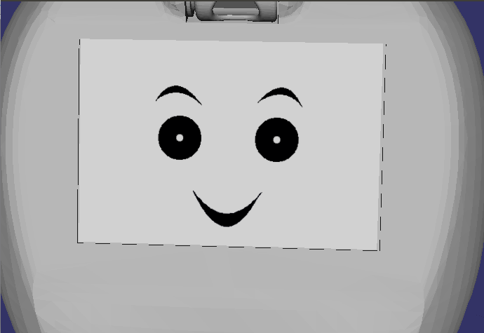
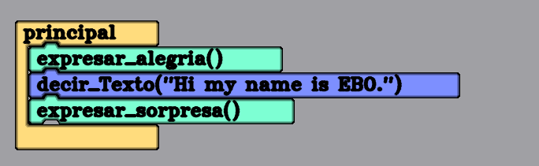

# Development of a Text To Speech component that operates offline for the EBO educational robot.

EBO is an educational robot that has the ability to express emotions. In addition, it has a programming platform designed in blocks so that children can learn to program in a simple way.

This robot lacked the ability to speak. This project has given EBO a voice offline. This voice has been generated from a neural network that has been trained to get a good tone.

The code done: 
[Get the code](https://github.com/inajarrob/learnbot/tree/text2speech/learnbot_dsl/components/tacotron)

EBO documentation:
[Documentation](https://github.com/robocomp/learnbot/wiki)

## Posts.
1. [Introduction.](https://robocomp.github.io/web/gsoc/2019/isabel_najarro/post01) 
2. [First advances.](https://robocomp.github.io/web/gsoc/2019/isabel_najarro/post02)
3. [The voice is taking shape.](https://robocomp.github.io/web/gsoc/2019/isabel_najarro/post03)
4. [Final results.](https://robocomp.github.io/web/gsoc/2019/isabel_najarro/post04)

## Commits.
[Commits](https://github.com/inajarrob/learnbot/commits/text2speech?author=inajarrob)

## Neural network used.
[Tacotron](https://github.com/keithito/tacotron)

## Example of the final version.
The example will be developed in the robot simulator. The code used for the example is:

Before launching the simulator, we will launch the component **tacotron**, from the component folder, as: 
> python3 src/tacotron.py etc/config 

After this, we will launch the simulator, add the client and start the components and the simulation. After the simulation we will get a temporary audio like this one:

[Audio](https://drive.google.com/file/d/1Ax8PKb9t_8DmJUQLPvcd9gS0usUcQhez/view?usp=sharing)

## Examples of the voice.
[Audio samples](https://github.com/inajarrob/AudioSamples)

## For the following versions.
- Improve the synthesis to get the audios in a more fluid way.
- Add Spanish language.
- Modulate the audios to represent more emotions.
